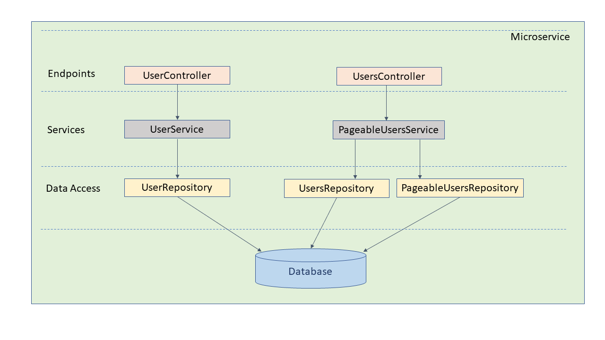

# userreg
User Registration with Spring Boot and Docker

Architecture

Build project:
./mvnw install dockerfile:build

Push the image to dockerhub:
./mvnw dockerfile:push

Run application:
docker run -d -p 8080:8080 dannyhui/userreg

Test with Postman:
Create a POST request:
Headers:
	COntent-Type: application/json
Body:
{
    "userName": "marksmith",
    "firstName": "Mark",
    "lastName": "Smith",
    "mobile": "4169084567",
    "email": "mark.smith@accenture.com",
    "address": "100 Bay St Toronto Q1J7S2 CA",
    "telephone": "6476785678"
}

Swagger doc URL:
http://localhost:8080/swagger-ui.html

